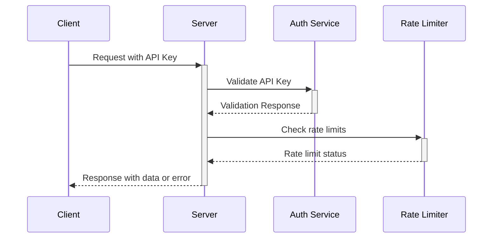

# Security Implementation

This document outlines the security measures implemented in the Periodic Table Visualization project.

## Security Architecture


## Key Security Principles

Following our established security practices:

1. **Input Validation**: All user and AI inputs are validated
2. **Rate Limiting**: API endpoints are rate-limited to prevent abuse
3. **Environmental Separation**: Sensitive data stored only in environment variables
4. **API Security**: All external APIs are secured with proper authentication

## API Security

### Authentication Flow



### API Key Management

API keys are never exposed in client-side code:

```tsx
// CORRECT: Server-side API key management
// src/lib/api/server.ts
import { createClient } from 'some-api-sdk';

export const apiClient = createClient({
  apiKey: process.env.API_KEY,
  // Other config
});

// INCORRECT: Never do this
// ❌ export const API_KEY = "sk-1234567890abcdef";
```

## Environment Variables

All sensitive data is stored in environment variables following secure patterns:

```bash
# .env.example (template, actual values never committed)
API_KEY=your-api-key-here
AUTH_SECRET=your-auth-secret
NODE_ENV=development
```

Environment variables are properly validated at startup:

```typescript
// src/lib/env.ts
export function validateEnv() {
  const requiredEnvVars = ['API_KEY', 'AUTH_SECRET'];
  
  for (const envVar of requiredEnvVars) {
    if (!process.env[envVar]) {
      throw new Error(`Missing required environment variable: ${envVar}`);
    }
  }
  
  return {
    apiKey: process.env.API_KEY,
    authSecret: process.env.AUTH_SECRET,
    isDevelopment: process.env.NODE_ENV === 'development',
  };
}
```

## Rate Limiting

To prevent abuse, API endpoints implement rate limiting:

```typescript
// src/middleware/rateLimiter.ts
import rateLimit from 'express-rate-limit';

export const apiLimiter = rateLimit({
  windowMs: 15 * 60 * 1000, // 15 minutes
  max: 100, // limit each IP to 100 requests per windowMs
  standardHeaders: true,
  legacyHeaders: false,
  message: {
    status: 429,
    message: 'Too many requests, please try again later.',
  },
});

// Apply to routes
app.use('/api/', apiLimiter);
```

## Input Validation

All inputs are validated using schemas:

```typescript
// src/lib/validation.ts
import { z } from 'zod';

export const ElementQuerySchema = z.object({
  atomicNumber: z.number().int().positive().optional(),
  symbol: z.string().max(3).optional(),
  name: z.string().max(20).optional(),
});

export function validateElementQuery(data: unknown) {
  return ElementQuerySchema.parse(data);
}
```

## XSS Protection

To prevent cross-site scripting:

1. React's built-in HTML escaping
2. Content Security Policy headers
3. Sanitization of user-generated content

```typescript
// src/middleware/securityHeaders.ts
import helmet from 'helmet';

export const securityHeaders = helmet({
  contentSecurityPolicy: {
    directives: {
      defaultSrc: ["'self'"],
      scriptSrc: ["'self'", "'unsafe-inline'"],
      styleSrc: ["'self'", "'unsafe-inline'", 'https://fonts.googleapis.com'],
      imgSrc: ["'self'", 'data:'],
      connectSrc: ["'self'", 'https://api.example.com'],
      fontSrc: ["'self'", 'https://fonts.gstatic.com'],
      objectSrc: ["'none'"],
      mediaSrc: ["'self'"],
      frameSrc: ["'none'"],
    },
  },
  // Other security headers
});

// Apply to Express app
app.use(securityHeaders);
```

## Error Handling

Security-related errors are handled carefully to avoid information leakage:

```typescript
// src/lib/errorHandler.ts
export function handleError(error: unknown, isProduction: boolean) {
  console.error('Error:', error);
  
  // In production, return generic error message
  if (isProduction) {
    return {
      message: 'An error occurred',
      status: 500,
    };
  }
  
  // In development, return more detailed error
  return {
    message: error instanceof Error ? error.message : 'Unknown error',
    stack: error instanceof Error ? error.stack : undefined,
    status: 500,
  };
}
```

## Security Best Practices

### For Developers

1. **Never commit secrets or API keys**
2. **Validate all inputs on both client and server**
3. **Implement proper error handling**
4. **Follow the principle of least privilege**
5. **Keep dependencies updated**

### For Operations

1. **Regularly rotate API keys and secrets**
2. **Monitor for suspicious activity**
3. **Implement real-time alerts for security events**
4. **Conduct periodic security reviews**

## Security Testing

We implement comprehensive security testing:

1. **Static Analysis**: Using ESLint security plugins
2. **Dependency Scanning**: Regular checks for vulnerable dependencies
3. **Penetration Testing**: Periodic security assessments
4. **Security Code Reviews**: Part of our PR process
